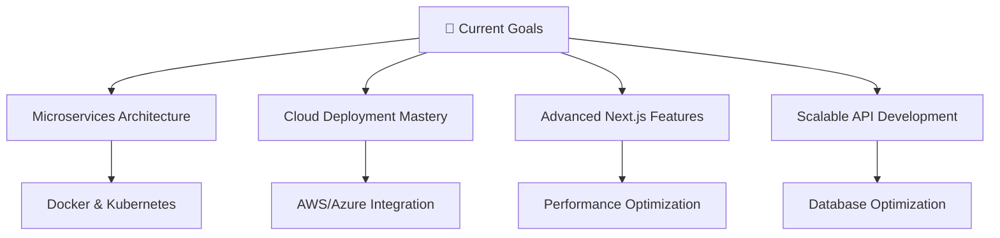

<div align="center">

#  Hi there, I'm Abdul Musawer Dinzad


</div>

---

<div align="center">
  
### 🌟 Building Digital Dreams with Code 🌟

</div>


## 🚀 About Me

**Full-Stack Web Developer** and **Computer Science Graduate** from Kabul University with extensive experience in building modern web applications. Currently working at **PGL (Peace Global Logistics)**, I specialize in creating scalable web solutions using cutting-edge technologies.

🔥 **What I do:** Build amazing web applications, explore new technologies, and solve complex problems  
💫 **Philosophy:** Code with passion, debug with patience!

<br clear="right"/>

---

## 💼 Professional Journey

<div align="center">

| 🏢 **Company** | 👨‍💻 **Role** | 📅 **Duration** | 🌟 **Highlights** |
|:--------------:|:-------------:|:---------------:|:-----------------:|
| **PGL (Peace Global Logistics)** | Full-Stack Web Developer | 2025 - Present | Leading web development projects |
| **Rupani Foundation-WFP** | Full-Stack Developer Intern | Jun 2024 - Jan 2025 | Built scalable web solutions |
| **Roshan TDCA** | Products Promoter | 2023 - 2024 | Customer engagement & demos |

</div>

---

## 🛠️ Tech Arsenal

<div align="center">

### 🎨 Frontend Magic
<p>
  
  
  
  
  
</p>

### ⚡ Backend Power
<p>
  
  
  
  
</p>

### 🗄️ Database & DevOps
<p>
  
  
  
  
</p>

</div>

---

## 🎯 Featured Projects

<div align="center">

### 🛒 **Shoppy E-commerce Platform**
  

```
🎨 Modern UI/UX Design    🔐 Secure Authentication    💳 Payment Integration
📊 Admin Dashboard        📱 Mobile Responsive        🚀 RESTful APIs
```

---

### 🌤️ **Weather Forecast App**
 

**🔗 [Live Demo](https://weather-app-nu-liard-83.vercel.app/)**

```
🌍 Real-time Weather Data    📍 Location-based Forecasts    📱 Responsive Design
🎯 Clean UI Interface        🔄 Auto-refresh Updates        📊 7-day Forecasts
```

---

### 🍽️ **Restaurant Management System**
 

```
🍕 Online Ordering System    📅 Table Reservations    ⭐ Customer Reviews
💰 Payment Processing        📊 Order Management      📱 Mobile Optimized
```

---

### 💼 **Custom Business Websites**
 

```
🎨 Custom Designs    🔍 SEO Optimized    ⚡ High Performance    📱 Fully Responsive
```

</div>

---

## 📊 GitHub Analytics

<div align="center">
  


</div>

<div align="center">
  


</div>

<div align="center">


</div>

---

## 🎯 Current Focus

<div align="center">



</div>

---

## 💬 Let's Talk About

<div align="center">

<table>
  <tr>
    <td align="center" width="33%">
      
      <br><strong>Frontend Development</strong>
      <br><sub>React • Next.js • Modern JavaScript</sub>
    </td>
    <td align="center" width="33%">
      
      <br><strong>Backend Architecture</strong>
      <br><sub>NestJS • Laravel • RESTful APIs</sub>
    </td>
    <td align="center" width="33%">
      
      <br><strong>Database Design</strong>
      <br><sub>PostgreSQL • Optimization • Security</sub>
    </td>
  </tr>
  <tr>
    <td align="center">
      
      <br><strong>DevOps & Deployment</strong>
      <br><sub>Docker • Git • CI/CD Pipelines</sub>
    </td>
    <td align="center">
      
      <br><strong>Problem Solving</strong>
      <br><sub>Algorithms • Code Optimization</sub>
    </td>
    <td align="center">
      
      <br><strong>Mobile-First Design</strong>
      <br><sub>Responsive • User Experience</sub>
    </td>
  </tr>
</table>

</div>

---

## 📫 Connect With Me

<div align="center">

<a href="https://musawer-cv.vercel.app/">
  
</a>
<a href="mailto:Dinzad.Musawer@gmail.com">
  
</a>
<a href="tel:+93744021022">
  
</a>
<a href="https://linkedin.com/in/YOUR_LINKEDIN">
  
</a>
<a href="https://github.com/immusawer">
  
</a>

<br><br>

📍 **Location:** Qala e Mussa, District no 10, Kabul, Afghanistan  
📱 **Phone:** +93 744021022 / +93 798668346  
✉️ **Email:** Dinzad.Musawer@gmail.com

</div>

---

<div align="center">

### 🌟 *"Great software is built by great teams, but it starts with passionate individuals who care about their craft"* 🌟


</div>

---

<div align="center">

**⭐ Don't forget to star my repositories if you find them interesting! ⭐**

</div>
