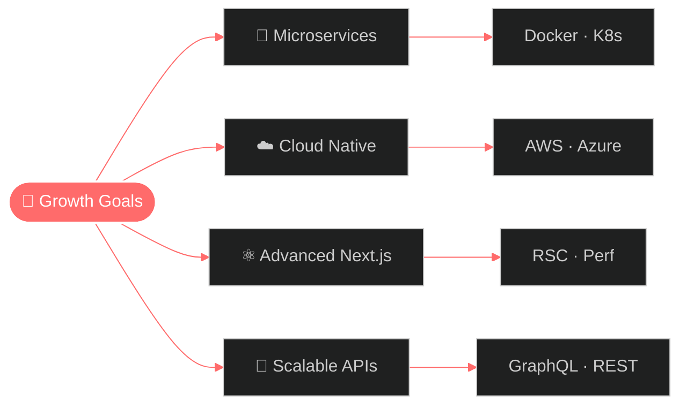

<!-- ========================================================== -->
<!--             ✦  ABDUL MUSAWER DINZAD  ·  GITHUB  ✦        -->
<!-- ========================================================== -->

<!-- ░░ ANIMATED HERO BANNER ░░ -->

<!-- ░░ TYPING HEADLINE ░░ -->

<!-- ░░ CONTRIBUTION SNAKE ░░ -->
<picture>
  <source media="(prefers-color-scheme: dark)" srcset="https://raw.githubusercontent.com/immusawer/immusawer/output/github-contribution-grid-snake-dark.svg" />
  <source media="(prefers-color-scheme: light)" srcset="https://raw.githubusercontent.com/immusawer/immusawer/output/github-contribution-grid-snake.svg" />
  
</picture>

 

<!-- ░░ ABOUT ME · ANIMATED SECTION BANNER ░░ -->

  

 

<!-- ░░ ABOUT ME · TERMINAL + AVATAR ░░ -->
<table>
<tr>
<td width="58%" valign="middle">

<!-- Live typing terminal -->

  

<!-- Animated status pills -->

  
  &nbsp;
  

  
  &nbsp;
  

</td>
<td width="42%" align="center" valign="middle">
  
   
  
   
  
</td>
</tr>
</table>

 

<!-- ░░ LIFE STATS · ANIMATED CARDS ░░ -->

<table>
<tr>
<td align="center" width="20%">
   
  <b>CS Grad</b> 
  Kabul Univ.
</td>
<td align="center" width="20%">
   
  <b>Full-Stack</b> 
  End to end
</td>
<td align="center" width="20%">
   
  <b>Shipped</b> 
  Production apps
</td>
<td align="center" width="20%">
   
  <b>Fueled</b> 
  by coffee
</td>
<td align="center" width="20%">
   
  <b>Learning</b> 
  every day
</td>
</tr>
</table>

 

<!-- ░░ NOW · CURRENTLY ░░ -->

####  &nbsp; What I'm Up To Right Now

<table>
<tr>
<td align="center" width="33%">
   
  <b>Working On</b> 
  Scalable web platforms at <b>PGL</b>
</td>
<td align="center" width="33%">
   
  <b>Learning</b> 
  Microservices Kubernetes · AWS
</td>
<td align="center" width="33%">
   
  <b>Open To</b> 
  Remote roles & collaborations
</td>
</tr>
</table>

 

<!-- ░░ TECH ARSENAL · BANNER ░░ -->

  

<table>
<tr>
<td valign="top" width="50%">

#### 🎨 &nbsp; Frontend Craft

#### 🗄️ &nbsp; Database Layer

</td>
<td valign="top" width="50%">

#### ⚡ &nbsp; Backend Power

#### 🚀 &nbsp; DevOps & Tools

</td>
</tr>
</table>

 

<!-- ░░ TIMELINE · BANNER ░░ -->

  

 

<table align="center">
<thead>
<tr>
<th>📅 &nbsp; Period</th>
<th>🏢 &nbsp; Company</th>
<th>👨‍💻 &nbsp; Role</th>
<th>✨ &nbsp; Impact</th>
</tr>
</thead>
<tbody>
<tr>
<td align="center"><b>2025 — Present</b></td>
<td><b>PGL</b> Peace Global Logistics</td>
<td>Full-Stack Web Developer</td>
<td>Leading modern web platform initiatives</td>
</tr>
<tr>
<td align="center"><b>Jun 2024 — Jan 2025</b></td>
<td><b>Rupani Foundation × WFP</b></td>
<td>Junior Full-Stack Developer</td>
<td>Built scalable humanitarian platforms</td>
</tr>
</tbody>
</table>

 

<!-- ░░ FEATURED PROJECTS · BANNER ░░ -->

  

 

<table>
<tr>
<td width="50%" valign="top">

### 💼 &nbsp; Portfolio & CV

📄 Full CV · 🎨 Modern design · 📱 Mobile-first

🔗 &nbsp; <a href="https://musawer-cv.vercel.app/"><b>Live Demo →</b></a>

</td>
<td width="50%" valign="top">

### 🌤️ &nbsp; Weather Forecast App

🌍 Real-time data · 📍 Geo-aware · 📊 7-day forecast

🔗 &nbsp; <a href="https://weather-app-nu-liard-83.vercel.app/"><b>Live Demo →</b></a>

</td>
</tr>
<tr>
<td width="50%" valign="top">

### 🍽️ &nbsp; Restaurant Management

🍕 Online orders · 📅 Reservations · 💰 Payments

</td>
<td width="50%" valign="top">

### 💼 &nbsp; Custom Business Suites

🎨 Custom UI · 🔍 SEO tuned · ⚡ Blazing fast

</td>
</tr>
</table>

 

<!-- ░░ GITHUB ANALYTICS · BANNER ░░ -->

  

 

<!-- ░░ SUMMARY CARDS ░░ -->

 

<!-- ░░ TROPHY CABINET · BANNER ░░ -->

  

 

  

 

<!-- ░░ MERMAID FOCUS MAP · BANNER ░░ -->

  

 

 

<!-- ░░ LET'S TALK · BANNER ░░ -->

  

 

<table>
<tr>
<td align="center" width="33%">
   
  <b>Frontend Engineering</b> 
  React · Next.js · Modern JS
</td>
<td align="center" width="33%">
   
  <b>Backend Architecture</b> 
  NestJS · Laravel · REST APIs
</td>
<td align="center" width="33%">
   
  <b>Database Design</b> 
  PostgreSQL · Optimization
</td>
</tr>
<tr>
<td align="center">
   
  <b>DevOps & Deploy</b> 
  Docker · Git · CI/CD
</td>
<td align="center">
   
  <b>Problem Solving</b> 
  Algorithms · Optimization
</td>
<td align="center">
   
  <b>Mobile-First UX</b> 
  Responsive · Accessible
</td>
</tr>
</table>

 

<!-- ░░ DEV WISDOM · BANNER ░░ -->

  

 

  

 

<!-- ░░ JOKE ░░ -->

  

 

<!-- ░░ CONNECT · BANNER ░░ -->

  

 

  

<table>
<tr>
<td>📍 &nbsp; <b>Location</b></td>
<td>Qala e Mussa, District 10 · Kabul · Afghanistan</td>
</tr>
<tr>
<td>📱 &nbsp; <b>Phone</b></td>
<td>+93 744 021 022 &nbsp;·&nbsp; +93 798 668 346</td>
</tr>
<tr>
<td>✉️ &nbsp; <b>Email</b></td>
<td>Dinzad.Musawer@gmail.com</td>
</tr>
</table>

 

<!-- ░░ SIGNATURE QUOTE ░░ -->

> ### ✨ *“Great software is built by great teams — but it starts with passionate individuals who care about their craft.”* ✨

 

<!-- ░░ FOOTER BANNER ░░ -->

⭐ &nbsp; *If you found something cool, consider leaving a star — it truly makes my day!* &nbsp; ⭐

